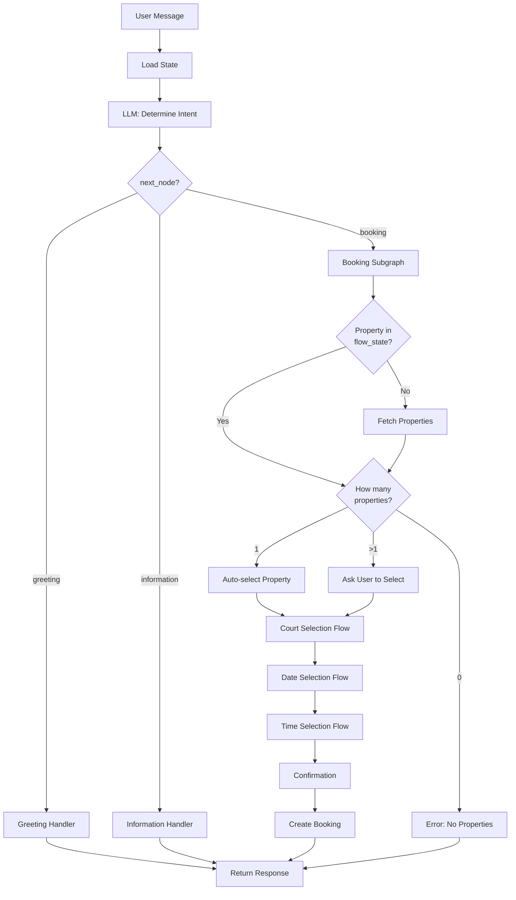

# Design Document: LLM-Driven Conversation Flow

## Overview

This design refactors the chatbot agent from rule-based routing to LLM-driven conversation flow. The system eliminates the FAQ node ambiguity, enables intelligent context-aware conversations, and maintains state through flow_state and bot_memory.

### Goals

- Remove rule-based routing logic and let the LLM make explicit routing decisions
- Eliminate FAQ/information node ambiguity by removing the FAQ node
- Enable context-aware conversations that skip redundant questions
- Maintain conversation state across messages and sessions
- Support on-demand property fetching instead of eager loading
- Auto-select properties and courts when only one option exists

### Key Design Decisions

1. **Three-Level LLM Decision Making**: The LLM makes routing decisions at three levels:
   - Main graph level: Routes to greeting, information, or booking subgraph
   - Subgraph level: Decides next node within booking subgraph
   - Node level: Calls tools based on user message (via LangChain)

2. **Explicit next_node Returns**: Every LLM invocation returns a next_node field that explicitly specifies where to route next, eliminating conditional routing logic

3. **Structured State Management**: flow_state maintains temporary booking progress while bot_memory persists user preferences across sessions

4. **Context-Aware Flow**: The system checks existing state before asking questions, enabling smart skipping of completed steps

5. **LangGraph Compatibility**: The design maintains compatibility with existing LangGraph architecture and tool integrations

## Architecture

### System Components

```
┌─────────────────────────────────────────────────────────────┐
│                      Main Graph                              │
│  ┌──────────┐   ┌──────────┐   ┌──────────────────────┐   │
│  │ Greeting │   │Information│   │  Booking Subgraph    │   │
│  │  Node    │   │   Node    │   │                      │   │
│  └──────────┘   └──────────┘   │  ┌────────────────┐  │   │
│                                  │  │ Property Node  │  │   │
│                                  │  ├────────────────┤  │   │
│                                  │  │  Court Node    │  │   │
│                                  │  ├────────────────┤  │   │
│                                  │  │   Date Node    │  │   │
│                                  │  ├────────────────┤  │   │
│                                  │  │   Time Node    │  │   │
│                                  │  ├────────────────┤  │   │
│                                  │  │ Confirm Node   │  │   │
│                                  │  ├────────────────┤  │   │
│                                  │  │  Create Node   │  │   │
│                                  │  └────────────────┘  │   │
│                                  └──────────────────────┘   │
└─────────────────────────────────────────────────────────────┘
                           │
                           ▼
              ┌────────────────────────┐
              │   State Management     │
              │  ┌──────────────────┐  │
              │  │   flow_state     │  │
              │  │  (temporary)     │  │
              │  └──────────────────┘  │
              │  ┌──────────────────┐  │
              │  │   bot_memory     │  │
              │  │  (persistent)    │  │
              │  └──────────────────┘  │
              └────────────────────────┘
                           │
                           ▼
              ┌────────────────────────┐
              │    Tool Integration    │
              │  ┌──────────────────┐  │
              │  │ Property Tools   │  │
              │  ├──────────────────┤  │
              │  │  Court Tools     │  │
              │  ├──────────────────┤  │
              │  │ Availability     │  │
              │  ├──────────────────┤  │
              │  │ Booking Tools    │  │
              │  └──────────────────┘  │
              └────────────────────────┘
```

### Conversation Flow



### LLM Response Structure

Every LLM invocation returns a structured response:

```python
{
    "next_node": "greeting" | "information" | "booking",
    "message": "Text response to user",
    "state_updates": {
        "flow_state": {
            "current_intent": "booking" | "information" | "greeting",
            "property_id": int | None,
            "property_name": str | None,
            "court_id": int | None,
            "court_name": str | None,
            "date": "YYYY-MM-DD" | None,
            "time_slot": "HH:MM-HH:MM" | None,
            "booking_step": "property_selected" | "court_selected" | 
                           "date_selected" | "time_selected" | "confirming",
            "owner_properties": List[Dict] | None,
            "context": Dict[str, Any]
        },
        "bot_memory": {
            "user_preferences": Dict[str, Any],
            "inferred_information": Dict[str, Any]
        }
    }
}
```

## Components and Interfaces

### Main Graph Components

#### 1. Greeting Node

**Purpose**: Initialize conversation and set up context

**Inputs**:
- ConversationState with user_message

**Outputs**:
- Updated ConversationState with:
  - Initialized flow_state
  - Initialized bot_memory
  - response_content with greeting message
  - next_node decision

**LLM Prompt Structure**:
```
You are a friendly chatbot assistant for a sports facility booking system.
The user has just started a conversation.

User message: {user_message}
Bot memory: {bot_memory}

Tasks:
1. Greet the user warmly
2. Determine if they have a specific intent (booking, information, or just greeting)
3. Initialize conversation context

Return JSON:
{
  "next_node": "greeting" | "information" | "booking",
  "message": "Your greeting response",
  "state_updates": {
    "flow_state": {"current_intent": "..."},
    "bot_memory": {"context": "..."}
  }
}
```

#### 2. Information Node

**Purpose**: Handle all non-booking informational queries using LangChain agent

**Inputs**:
- ConversationState with user_message
- flow_state with context
- bot_memory with preferences

**Outputs**:
- Updated ConversationState with:
  - response_content with information
  - search_results if tools were called
  - next_node decision

**Available Tools**:
- search_properties_tool
- get_property_details_tool
- search_courts_tool
- get_court_details_tool
- get_availability_tool
- get_pricing_tool

**LLM Agent Configuration**:
```python
agent = create_react_agent(
    llm=llm_provider,
    tools=[
        search_properties_tool,
        get_property_details_tool,
        search_courts_tool,
        get_court_details_tool,
        availability_tool,
        pricing_tool
    ],
    prompt=information_prompt
)
```

#### 3. Booking Subgraph

**Purpose**: Manage sequential booking flow with context awareness

**Entry Point**: Property selection (or skip if already in flow_state)

**Nodes**:
1. Property Selection Node
2. Court Selection Node
3. Date Selection Node
4. Time Selection Node
5. Confirmation Node
6. Create Booking Node

**State Flow**:
```
flow_state.booking_step progression:
  None → property_selected → court_selected → date_selected → 
  time_selected → confirming → completed
```

### Booking Subgraph Node Details

#### Property Selection Node

**Logic**:
```python
async def select_property_node(state: ConversationState):
    flow_state = state["flow_state"]
    
    # Check if property already selected
    if flow_state.get("property_id"):
        return {"next_node": "court_selection"}
    
    # Fetch owner properties if not cached
    if not flow_state.get("owner_properties"):
        properties = await get_owner_properties_tool(
            state["owner_profile_id"]
        )
        flow_state["owner_properties"] = properties
    
    properties = flow_state["owner_properties"]
    
    # Handle different property counts
    if len(properties) == 0:
        return {
            "response_content": "You don't have any properties set up yet.",
            "next_node": "end"
        }
    elif len(properties) == 1:
        # Auto-select single property
        flow_state["property_id"] = properties[0]["id"]
        flow_state["property_name"] = properties[0]["name"]
        flow_state["booking_step"] = "property_selected"
        return {"next_node": "court_selection"}
    else:
        # Ask user to select
        return {
            "response_content": format_property_list(properties),
            "response_type": "list",
            "response_metadata": {"properties": properties},
            "next_node": "wait_for_selection"
        }
```

#### Court Selection Node

**Logic**:
```python
async def select_court_node(state: ConversationState):
    flow_state = state["flow_state"]
    
    # Check if court already selected
    if flow_state.get("court_id"):
        return {"next_node": "date_selection"}
    
    # Fetch courts for selected property
    property_id = flow_state["property_id"]
    courts = await get_property_courts_tool(
        property_id=property_id,
        owner_id=state["owner_profile_id"]
    )
    
    # Handle different court counts
    if len(courts) == 0:
        return {
            "response_content": "This property has no courts available.",
            "next_node": "end"
        }
    elif len(courts) == 1:
        # Auto-select single court
        flow_state["court_id"] = courts[0]["id"]
        flow_state["court_name"] = courts[0]["name"]
        flow_state["booking_step"] = "court_selected"
        return {"next_node": "date_selection"}
    else:
        # Ask user to select
        return {
            "response_content": format_court_list(courts),
            "response_type": "list",
            "response_metadata": {"courts": courts},
            "next_node": "wait_for_selection"
        }
```

#### Date Selection Node

**Logic**:
```python
async def select_date_node(state: ConversationState):
    flow_state = state["flow_state"]
    
    # Check if date already selected
    if flow_state.get("date"):
        return {"next_node": "time_selection"}
    
    # Use LLM to parse date from user message
    user_message = state["user_message"]
    bot_memory = state["bot_memory"]
    
    llm_response = await llm_provider.invoke(
        prompt=date_extraction_prompt,
        context={
            "user_message": user_message,
            "bot_memory": bot_memory,
            "current_date": datetime.now().isoformat()
        }
    )
    
    if llm_response.get("date"):
        flow_state["date"] = llm_response["date"]
        flow_state["booking_step"] = "date_selected"
        return {"next_node": "time_selection"}
    else:
        # Ask for date
        return {
            "response_content": "What date would you like to book?",
            "response_type": "text",
            "next_node": "wait_for_date"
        }
```

#### Time Selection Node

**Logic**:
```python
async def select_time_node(state: ConversationState):
    flow_state = state["flow_state"]
    
    # Check if time already selected
    if flow_state.get("time_slot"):
        return {"next_node": "confirmation"}
    
    # Fetch available time slots
    court_id = flow_state["court_id"]
    date = flow_state["date"]
    
    availability = await get_availability_tool(
        court_id=court_id,
        date=date
    )
    
    # Use LLM to parse time from user message or present options
    user_message = state["user_message"]
    bot_memory = state["bot_memory"]
    
    llm_response = await llm_provider.invoke(
        prompt=time_extraction_prompt,
        context={
            "user_message": user_message,
            "bot_memory": bot_memory,
            "available_slots": availability
        }
    )
    
    if llm_response.get("time_slot"):
        flow_state["time_slot"] = llm_response["time_slot"]
        flow_state["booking_step"] = "time_selected"
        return {"next_node": "confirmation"}
    else:
        # Present available slots
        return {
            "response_content": format_time_slots(availability),
            "response_type": "list",
            "response_metadata": {"slots": availability},
            "next_node": "wait_for_time"
        }
```

#### Confirmation Node

**Logic**:
```python
async def confirm_booking_node(state: ConversationState):
    flow_state = state["flow_state"]
    
    # Build confirmation summary
    summary = {
        "property": flow_state["property_name"],
        "court": flow_state["court_name"],
        "date": flow_state["date"],
        "time": flow_state["time_slot"]
    }
    
    # Get pricing
    pricing = await get_pricing_tool(
        court_id=flow_state["court_id"],
        date=flow_state["date"],
        time_slot=flow_state["time_slot"]
    )
    summary["price"] = pricing["total_price"]
    
    # Use LLM to check for confirmation
    user_message = state["user_message"]
    
    llm_response = await llm_provider.invoke(
        prompt=confirmation_prompt,
        context={
            "user_message": user_message,
            "booking_summary": summary
        }
    )
    
    if llm_response.get("confirmed"):
        flow_state["booking_step"] = "confirming"
        return {"next_node": "create_booking"}
    elif llm_response.get("modify"):
        # User wants to change something
        return {"next_node": "property_selection"}
    else:
        # User cancelled
        return {
            "response_content": "Booking cancelled.",
            "next_node": "end"
        }
```

#### Create Booking Node

**Logic**:
```python
async def create_booking_node(state: ConversationState):
    flow_state = state["flow_state"]
    
    # Parse time slot
    start_time, end_time = parse_time_slot(flow_state["time_slot"])
    
    # Create booking
    result = await create_booking_tool(
        customer_id=state["user_id"],
        court_id=flow_state["court_id"],
        booking_date=flow_state["date"],
        start_time=start_time,
        end_time=end_time
    )
    
    if result["success"]:
        # Clear flow_state
        state["flow_state"] = {}
        
        return {
            "response_content": format_booking_confirmation(result["data"]),
            "response_type": "text",
            "next_node": "end"
        }
    else:
        return {
            "response_content": f"Booking failed: {result['message']}",
            "next_node": "end"
        }
```

## Data Models

### ConversationState (TypedDict)

```python
class ConversationState(TypedDict):
    # Identifiers
    chat_id: str
    user_id: str
    owner_profile_id: str
    
    # Current message
    user_message: str
    
    # Persistent state
    flow_state: Dict[str, Any]
    bot_memory: Dict[str, Any]
    
    # Processing state
    messages: List[Dict[str, str]]
    intent: Optional[str]
    
    # Response building
    response_content: str
    response_type: str
    response_metadata: Dict[str, Any]
    
    # Metrics
    token_usage: Optional[int]
    
    # Tool results
    search_results: Optional[List[Dict[str, Any]]]
    availability_data: Optional[Dict[str, Any]]
    pricing_data: Optional[Dict[str, Any]]
```

### flow_state Structure

```python
{
    "current_intent": "booking" | "information" | "greeting",
    "property_id": int | None,
    "property_name": str | None,
    "court_id": int | None,
    "court_name": str | None,
    "date": "YYYY-MM-DD" | None,
    "time_slot": "HH:MM-HH:MM" | None,
    "booking_step": "property_selected" | "court_selected" | 
                   "date_selected" | "time_selected" | "confirming" | None,
    "owner_properties": List[Dict[str, Any]] | None,
    "context": Dict[str, Any]
}
```

### bot_memory Structure

```python
{
    "conversation_history": List[Dict[str, str]],
    "user_preferences": {
        "preferred_time": "morning" | "afternoon" | "evening" | None,
        "preferred_sport": str | None,
        "preferred_property": int | None,
        "preferred_court": int | None
    },
    "inferred_information": {
        "booking_frequency": "regular" | "occasional" | "first_time",
        "interests": List[str],
        "context_notes": str
    }
}
```

### Tool Response Formats

#### Property Tool Response
```python
{
    "id": int,
    "name": str,
    "address": str,
    "city": str,
    "phone": str,
    "courts": List[Dict]
}
```

#### Court Tool Response
```python
{
    "id": int,
    "name": str,
    "sport_type": str,
    "surface_type": str,
    "is_indoor": bool,
    "property_id": int,
    "property_name": str
}
```

#### Availability Tool Response
```python
{
    "date": "YYYY-MM-DD",
    "available_slots": [
        {
            "start_time": "HH:MM",
            "end_time": "HH:MM",
            "price_per_hour": float
        }
    ]
}
```

#### Booking Tool Response
```python
{
    "success": bool,
    "message": str,
    "data": {
        "id": int,
        "booking_date": "YYYY-MM-DD",
        "start_time": "HH:MM:SS",
        "end_time": "HH:MM:SS",
        "total_price": float,
        "status": "pending",
        "payment_status": "pending"
    }
}
```


## Correctness Properties

*A property is a characteristic or behavior that should hold true across all valid executions of a system—essentially, a formal statement about what the system should do. Properties serve as the bridge between human-readable specifications and machine-verifiable correctness guarantees.*

### Property 1: LLM Response Structure Completeness

*For any* LLM invocation in the chatbot system, the response SHALL contain a next_node field with one of the valid values ("greeting", "information", "booking"), a message field containing text for the user, and a state_updates field containing updates to flow_state or bot_memory.

**Validates: Requirements 2.1, 13.1, 13.3, 13.4**

### Property 2: Routing Follows LLM Decision

*For any* user message processed by the chatbot, the system SHALL route to the node specified in the LLM's next_node field, and the conversation SHALL continue from that node.

**Validates: Requirements 1.2, 2.4**

### Property 3: Flow State Structure Validity

*For any* conversation state after processing a message, the flow_state SHALL contain a current_intent field with values from {"booking", "information", "greeting"}, and MAY contain optional fields: property_id, property_name, court_id, court_name, date (YYYY-MM-DD format), time_slot (HH:MM-HH:MM format), booking_step, owner_properties, and context.

**Validates: Requirements 3.1, 3.2, 3.3, 3.4, 3.5, 3.6, 3.7, 3.8**

### Property 4: Flow State Persistence Within Session

*For any* conversation session, if flow_state is updated in message N, then the same flow_state data SHALL be available when processing message N+1 within the same session.

**Validates: Requirements 3.9**

### Property 5: Bot Memory Preference Storage

*For any* user message that expresses or implies a preference (time preference, sport preference, property preference), the LLM SHALL store that preference in bot_memory, and the preference SHALL be available in subsequent messages.

**Validates: Requirements 4.1, 4.2**

### Property 6: Bot Memory Prevents Redundant Questions

*For any* question that the LLM might ask, if bot_memory contains information that answers that question, the LLM SHALL NOT ask the question again.

**Validates: Requirements 4.5**

### Property 7: Bot Memory Persistence Across Sessions

*For any* user, if bot_memory is updated in conversation session N, then the same bot_memory data SHALL be available when the user starts conversation session N+1.

**Validates: Requirements 4.6**

### Property 8: On-Demand Property Fetching

*For any* conversation that starts with a booking intent, owner_properties SHALL NOT be fetched during conversation initialization, but SHALL be fetched when the booking flow begins.

**Validates: Requirements 5.1, 5.2**

### Property 9: Property Caching in Flow State

*For any* booking flow, when owner_properties are fetched, they SHALL be stored in flow_state, and subsequent property lookups within the same session SHALL use the cached data without fetching again.

**Validates: Requirements 5.3, 5.4**

### Property 10: Single Property Auto-Selection

*For any* booking flow where owner_properties contains exactly one property, the system SHALL automatically select that property, store it in flow_state (property_id and property_name), and SHALL NOT ask the user to select a property.

**Validates: Requirements 6.1, 6.2, 6.4**

### Property 11: Single Court Auto-Selection

*For any* booking flow where the selected property has exactly one court, the system SHALL automatically select that court, store it in flow_state (court_id and court_name), and SHALL NOT ask the user to select a court.

**Validates: Requirements 14.1, 14.2, 14.3**

### Property 12: Booking Step Skipping with Existing Data

*For any* booking flow, if flow_state contains property_id, the property selection step SHALL be skipped; if flow_state contains court_id, the court selection step SHALL be skipped; if flow_state contains date, the date selection step SHALL be skipped; if flow_state contains time_slot, the time selection step SHALL be skipped.

**Validates: Requirements 7.1, 7.2, 7.3, 7.4**

### Property 13: Booking Flow Proceeds to Next Incomplete Step

*For any* booking flow with partial data in flow_state, the system SHALL proceed directly to the first incomplete step in the sequence (property → court → date → time → confirmation), skipping all completed steps.

**Validates: Requirements 7.6**

### Property 14: Booking Flow Sequential Ordering

*For any* completed booking flow, the steps SHALL occur in the order: property selection, court selection, date selection, time selection, confirmation, and the system SHALL NOT allow proceeding to confirmation without completing all prior steps.

**Validates: Requirements 8.1, 8.3, 8.4**

### Property 15: Booking Step State Updates

*For any* booking flow, when a step is completed (property selected, court selected, date selected, time selected), the booking_step field in flow_state SHALL be updated to reflect the completed step ("property_selected", "court_selected", "date_selected", "time_selected", "confirming").

**Validates: Requirements 8.2**

### Property 16: Booking Step Validation

*For any* booking flow step transition, the system SHALL validate the data for the current step before proceeding to the next step, and SHALL reject invalid data with an appropriate error message.

**Validates: Requirements 8.5**

### Property 17: State Updates Applied Before Routing

*For any* LLM response containing state_updates, the system SHALL apply those updates to flow_state and bot_memory before routing to the next_node.

**Validates: Requirements 13.5**

### Property 18: Flow State Cleared After Booking Completion

*For any* booking flow, when the booking is successfully created or cancelled, the flow_state SHALL be cleared (reset to empty or initial state).

**Validates: Requirements 15.5**

## Error Handling

### Error Categories

1. **LLM Response Errors**
   - Missing next_node field
   - Invalid next_node value
   - Malformed response structure
   - LLM API timeout or failure

2. **State Management Errors**
   - Flow state corruption
   - Bot memory persistence failure
   - State deserialization errors

3. **Tool Invocation Errors**
   - Property fetch failure
   - Court fetch failure
   - Availability check failure
   - Booking creation failure

4. **Validation Errors**
   - Invalid date format
   - Invalid time slot format
   - Missing required booking data
   - Conflicting booking data

### Error Handling Strategies

#### LLM Response Errors

**Missing next_node**:
```python
if "next_node" not in llm_response:
    logger.warning(f"LLM response missing next_node, defaulting to current node")
    next_node = state.get("current_node", "greeting")
```

**Invalid next_node**:
```python
valid_nodes = ["greeting", "information", "booking"]
if llm_response["next_node"] not in valid_nodes:
    logger.error(f"Invalid next_node: {llm_response['next_node']}")
    next_node = "greeting"  # Safe default
```

**LLM API Failure**:
```python
try:
    llm_response = await llm_provider.invoke(prompt, context)
except LLMAPIError as e:
    logger.error(f"LLM API error: {e}")
    return {
        "response_content": "I'm having trouble processing your request. Please try again.",
        "next_node": "greeting"
    }
```

#### State Management Errors

**Flow State Corruption**:
```python
try:
    flow_state = validate_flow_state(state["flow_state"])
except ValidationError as e:
    logger.error(f"Flow state validation failed: {e}")
    flow_state = initialize_flow_state()
```

**Bot Memory Persistence Failure**:
```python
try:
    await save_bot_memory(chat_id, bot_memory)
except DatabaseError as e:
    logger.error(f"Failed to persist bot_memory: {e}")
    # Continue execution - memory will be lost but conversation can proceed
```

#### Tool Invocation Errors

**Property Fetch Failure**:
```python
try:
    properties = await get_owner_properties_tool(owner_profile_id)
except ToolError as e:
    logger.error(f"Failed to fetch properties: {e}")
    return {
        "response_content": "I'm having trouble accessing your properties. Please try again later.",
        "next_node": "end"
    }
```

**Booking Creation Failure**:
```python
result = await create_booking_tool(...)
if not result["success"]:
    logger.warning(f"Booking creation failed: {result['message']}")
    return {
        "response_content": f"Unable to create booking: {result['message']}. Please try different time slot.",
        "next_node": "time_selection"
    }
```

#### Validation Errors

**Invalid Date Format**:
```python
try:
    parsed_date = datetime.strptime(date_string, "%Y-%m-%d").date()
except ValueError:
    return {
        "response_content": "I didn't understand that date. Please use format YYYY-MM-DD (e.g., 2024-01-15).",
        "next_node": "date_selection"
    }
```

**Missing Required Data**:
```python
required_fields = ["property_id", "court_id", "date", "time_slot"]
missing = [f for f in required_fields if not flow_state.get(f)]
if missing:
    logger.error(f"Missing required booking data: {missing}")
    return {
        "response_content": "Some booking information is missing. Let's start over.",
        "next_node": "property_selection"
    }
```

### Error Recovery Patterns

1. **Graceful Degradation**: When non-critical errors occur, continue conversation with reduced functionality
2. **Safe Defaults**: Use safe default values (e.g., route to greeting) when decisions cannot be made
3. **User Notification**: Always inform users when errors affect their experience
4. **State Reset**: Clear corrupted state and restart flow when recovery is not possible
5. **Retry Logic**: Implement exponential backoff for transient failures (LLM API, database)

## Testing Strategy

### Dual Testing Approach

This feature requires both unit tests and property-based tests to ensure comprehensive coverage:

- **Unit tests**: Verify specific examples, edge cases, and error conditions
- **Property tests**: Verify universal properties across all inputs using randomized testing

Together, these approaches provide comprehensive coverage where unit tests catch concrete bugs and property tests verify general correctness across the input space.

### Property-Based Testing

**Framework**: Use `hypothesis` library for Python property-based testing

**Configuration**: Each property test should run minimum 100 iterations to ensure adequate coverage through randomization

**Test Tagging**: Each property test must include a comment tag referencing the design property:
```python
# Feature: llm-driven-conversation, Property 1: LLM Response Structure Completeness
@given(user_message=st.text(), context=st.dictionaries(st.text(), st.text()))
def test_llm_response_structure(user_message, context):
    ...
```

### Property Test Specifications

#### Property 1: LLM Response Structure Completeness

```python
# Feature: llm-driven-conversation, Property 1: LLM Response Structure Completeness
@given(
    user_message=st.text(min_size=1),
    flow_state=st.dictionaries(st.text(), st.text()),
    bot_memory=st.dictionaries(st.text(), st.text())
)
@settings(max_examples=100)
async def test_llm_response_structure_completeness(user_message, flow_state, bot_memory):
    """Test that LLM always returns complete response structure"""
    state = create_conversation_state(
        user_message=user_message,
        flow_state=flow_state,
        bot_memory=bot_memory
    )
    
    response = await llm_provider.invoke(prompt, state)
    
    # Verify required fields exist
    assert "next_node" in response
    assert "message" in response
    assert "state_updates" in response
    
    # Verify next_node has valid value
    assert response["next_node"] in ["greeting", "information", "booking"]
    
    # Verify message is non-empty string
    assert isinstance(response["message"], str)
    assert len(response["message"]) > 0
    
    # Verify state_updates is a dict
    assert isinstance(response["state_updates"], dict)
```

#### Property 4: Flow State Persistence Within Session

```python
# Feature: llm-driven-conversation, Property 4: Flow State Persistence Within Session
@given(
    messages=st.lists(st.text(min_size=1), min_size=2, max_size=5),
    initial_flow_state=st.dictionaries(st.text(), st.text())
)
@settings(max_examples=100)
async def test_flow_state_persistence_within_session(messages, initial_flow_state):
    """Test that flow_state persists across messages in same session"""
    chat_id = str(uuid.uuid4())
    
    # Initialize session with flow_state
    state = create_conversation_state(
        chat_id=chat_id,
        user_message=messages[0],
        flow_state=initial_flow_state
    )
    
    # Process first message
    result1 = await process_message(state)
    flow_state_after_msg1 = result1["flow_state"]
    
    # Process second message
    state2 = create_conversation_state(
        chat_id=chat_id,
        user_message=messages[1],
        flow_state={}  # Empty - should be loaded from session
    )
    result2 = await process_message(state2)
    
    # Verify flow_state from message 1 is available in message 2
    # (at minimum, the data should be loadable)
    loaded_state = await load_flow_state(chat_id)
    assert loaded_state == flow_state_after_msg1
```

#### Property 10: Single Property Auto-Selection

```python
# Feature: llm-driven-conversation, Property 10: Single Property Auto-Selection
@given(
    property_data=st.builds(
        dict,
        id=st.integers(min_value=1),
        name=st.text(min_size=1),
        address=st.text(min_size=1)
    )
)
@settings(max_examples=100)
async def test_single_property_auto_selection(property_data):
    """Test that single property is auto-selected without asking user"""
    # Mock property fetch to return single property
    with mock.patch('get_owner_properties_tool', return_value=[property_data]):
        state = create_conversation_state(
            user_message="I want to book a court",
            flow_state={"current_intent": "booking"}
        )
        
        result = await select_property_node(state)
        
        # Verify property was auto-selected
        assert result["flow_state"]["property_id"] == property_data["id"]
        assert result["flow_state"]["property_name"] == property_data["name"]
        
        # Verify user was NOT asked to select (next node should skip to court selection)
        assert result["next_node"] == "court_selection"
        
        # Verify response doesn't ask for property selection
        assert "select" not in result["response_content"].lower()
        assert "which property" not in result["response_content"].lower()
```

#### Property 12: Booking Step Skipping with Existing Data

```python
# Feature: llm-driven-conversation, Property 12: Booking Step Skipping with Existing Data
@given(
    property_id=st.integers(min_value=1),
    court_id=st.integers(min_value=1),
    date=st.dates(min_value=date.today()),
    time_slot=st.text(regex=r'\d{2}:\d{2}-\d{2}:\d{2}')
)
@settings(max_examples=100)
async def test_booking_step_skipping(property_id, court_id, date, time_slot):
    """Test that booking steps are skipped when data exists in flow_state"""
    # Test property skip
    state_with_property = create_conversation_state(
        user_message="book a court",
        flow_state={"property_id": property_id, "current_intent": "booking"}
    )
    result = await booking_subgraph.invoke(state_with_property)
    # Should skip property selection
    assert "select_property" not in result["visited_nodes"]
    
    # Test court skip
    state_with_court = create_conversation_state(
        user_message="book a court",
        flow_state={
            "property_id": property_id,
            "court_id": court_id,
            "current_intent": "booking"
        }
    )
    result = await booking_subgraph.invoke(state_with_court)
    # Should skip property and court selection
    assert "select_property" not in result["visited_nodes"]
    assert "select_court" not in result["visited_nodes"]
    
    # Test date skip
    state_with_date = create_conversation_state(
        user_message="book a court",
        flow_state={
            "property_id": property_id,
            "court_id": court_id,
            "date": date.isoformat(),
            "current_intent": "booking"
        }
    )
    result = await booking_subgraph.invoke(state_with_date)
    # Should skip property, court, and date selection
    assert "select_date" not in result["visited_nodes"]
    
    # Test time skip
    state_with_time = create_conversation_state(
        user_message="book a court",
        flow_state={
            "property_id": property_id,
            "court_id": court_id,
            "date": date.isoformat(),
            "time_slot": time_slot,
            "current_intent": "booking"
        }
    )
    result = await booking_subgraph.invoke(state_with_time)
    # Should skip all selection steps and go to confirmation
    assert result["current_node"] == "confirmation"
```

#### Property 14: Booking Flow Sequential Ordering

```python
# Feature: llm-driven-conversation, Property 14: Booking Flow Sequential Ordering
@given(
    user_messages=st.lists(st.text(min_size=1), min_size=5, max_size=5)
)
@settings(max_examples=100)
async def test_booking_flow_sequential_ordering(user_messages):
    """Test that booking flow follows correct sequence"""
    state = create_conversation_state(
        user_message=user_messages[0],
        flow_state={"current_intent": "booking"}
    )
    
    visited_nodes = []
    
    # Simulate booking flow
    for msg in user_messages:
        state["user_message"] = msg
        result = await booking_subgraph.invoke(state)
        visited_nodes.append(result["current_node"])
        state = result
    
    # Define expected sequence
    expected_sequence = [
        "select_property",
        "select_court",
        "select_date",
        "select_time",
        "confirmation"
    ]
    
    # Verify nodes appear in correct order (some may be skipped)
    sequence_indices = []
    for node in visited_nodes:
        if node in expected_sequence:
            sequence_indices.append(expected_sequence.index(node))
    
    # Indices should be monotonically increasing (no going backwards)
    assert all(sequence_indices[i] <= sequence_indices[i+1] 
               for i in range(len(sequence_indices)-1))
    
    # Confirmation should not appear before all other steps
    if "confirmation" in visited_nodes:
        conf_index = visited_nodes.index("confirmation")
        # At least property, court, date, time should be in flow_state
        assert state["flow_state"].get("property_id") is not None
        assert state["flow_state"].get("court_id") is not None
        assert state["flow_state"].get("date") is not None
        assert state["flow_state"].get("time_slot") is not None
```

### Unit Test Specifications

#### Edge Cases

**Test: Missing next_node defaults to current node**
```python
def test_missing_next_node_defaults():
    """Test that missing next_node defaults to current node (Requirement 2.5)"""
    llm_response = {
        "message": "Hello",
        "state_updates": {}
        # next_node is missing
    }
    
    state = {"current_node": "greeting"}
    next_node = determine_next_node(llm_response, state)
    
    assert next_node == "greeting"
```

**Test: Properties not fetched at initialization**
```python
def test_properties_not_fetched_at_init():
    """Test that properties are not fetched at conversation start (Requirement 5.1)"""
    with mock.patch('get_owner_properties_tool') as mock_fetch:
        state = initialize_conversation(chat_id="123", user_id="456")
        
        # Verify fetch was not called
        mock_fetch.assert_not_called()
        
        # Verify owner_properties is not in flow_state
        assert "owner_properties" not in state["flow_state"]
```

#### Example Tests

**Test: Morning preference stored in bot_memory**
```python
def test_morning_preference_storage():
    """Test that morning preference is stored (Requirement 4.3)"""
    state = create_conversation_state(
        user_message="I prefer morning time slots",
        bot_memory={}
    )
    
    result = await process_message(state)
    
    # Verify preference was stored
    assert "user_preferences" in result["bot_memory"]
    assert result["bot_memory"]["user_preferences"].get("preferred_time") == "morning"
```

**Test: Greeting handler is first node**
```python
def test_greeting_handler_first():
    """Test that greeting handler processes first message (Requirement 10.4)"""
    state = create_conversation_state(
        user_message="Hello",
        flow_state={},
        bot_memory={}
    )
    
    result = await main_graph.invoke(state)
    
    # Verify greeting handler was invoked
    assert result["visited_nodes"][0] == "greeting"
```

**Test: Property details query handled by information handler**
```python
def test_property_details_information_handler():
    """Test that property details query goes to information handler (Requirement 9.5)"""
    state = create_conversation_state(
        user_message="Tell me about the Downtown Sports Center"
    )
    
    result = await main_graph.invoke(state)
    
    # Verify information handler was invoked
    assert "information" in result["visited_nodes"]
```

**Test: Court availability query handled by information handler**
```python
def test_court_availability_information_handler():
    """Test that court availability query goes to information handler (Requirement 9.6)"""
    state = create_conversation_state(
        user_message="What courts are available tomorrow?"
    )
    
    result = await main_graph.invoke(state)
    
    # Verify information handler was invoked
    assert "information" in result["visited_nodes"]
```

**Test: "book it" with single property skips selection**
```python
def test_book_it_single_property():
    """Test that 'book it' with one property skips selection (Requirement 6.3)"""
    property_data = {"id": 1, "name": "Test Property"}
    
    with mock.patch('get_owner_properties_tool', return_value=[property_data]):
        state = create_conversation_state(
            user_message="book it",
            flow_state={"current_intent": "booking"}
        )
        
        result = await booking_subgraph.invoke(state)
        
        # Verify property was auto-selected
        assert result["flow_state"]["property_id"] == 1
        
        # Verify property selection was skipped
        assert "select_property" not in result["visited_nodes"]
```

### Integration Tests

Integration tests verify compatibility with existing systems:

1. **LangGraph Integration**: Verify state flows correctly through LangGraph nodes
2. **Tool Integration**: Verify all existing tools work without modification
3. **Database Integration**: Verify flow_state and bot_memory persistence
4. **LLM Provider Integration**: Verify LLM API calls work correctly

### Test Coverage Goals

- **Property Tests**: 100% coverage of all correctness properties
- **Unit Tests**: 90%+ code coverage
- **Integration Tests**: All critical paths covered
- **Edge Cases**: All identified edge cases tested

